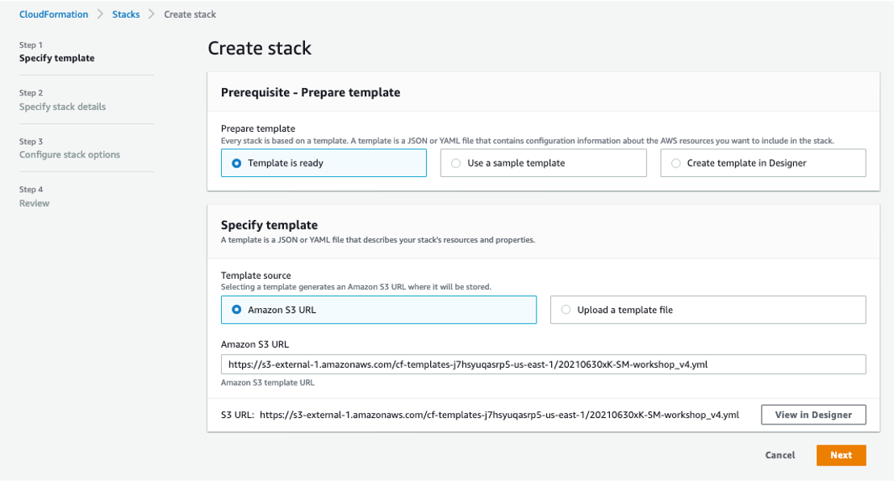
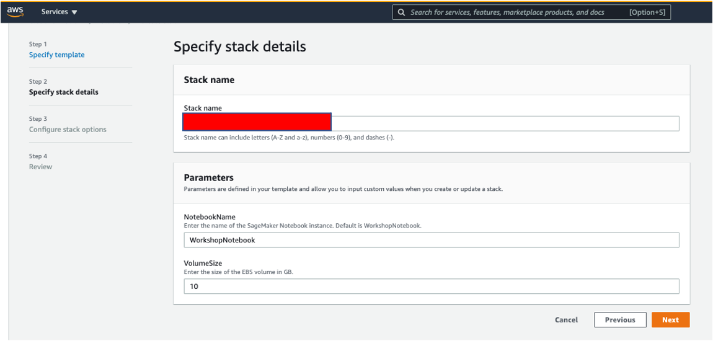
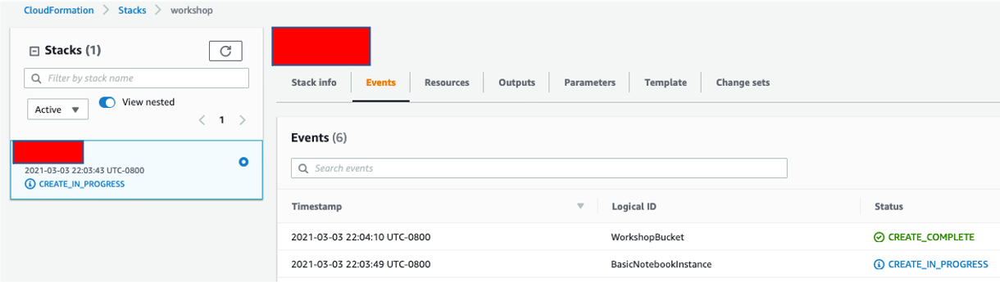
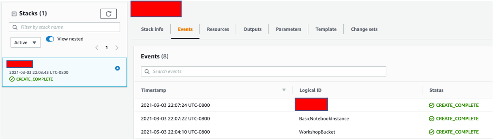
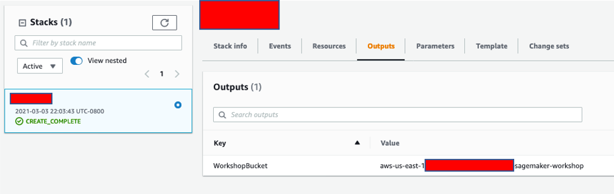
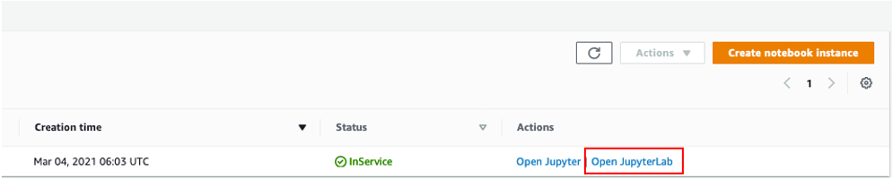
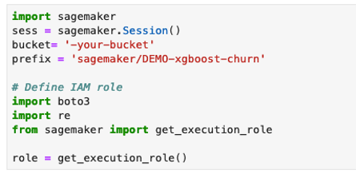

## Lab Environment Setup

## SageMaker hands-on lab 

The first step is to deploy a CloudFormation template that will perform much of the initial setup work for you. In another tab, login to your AWS account. Once you have done that, open the link below in a new tab (right click on the icon below) to start the process of deploying the items you need via CloudFormation.

<!-- [](https://console.aws.amazon.com/cloudformation/home#/stacks/new?stackName=workshop&templateURL=https://ali-sagemaker-workshop-us-west-2.s3-us-west-2.amazonaws.com/SM-workshop.yml) -->

[](https://console.aws.amazon.com/cloudformation/home#/stacks/new?stackName=workshop&templateURL=https://s3-external-1.amazonaws.com/cf-templates-j7hsyuqasrp5-us-east-1/20210769FU-SM-workshop_HPO.yml)

Follow along with the screenshots below.


Start by clicking `Next` at the bottom as shown:
<br ><br />


Write down a name for the stack (`names can consist only of lowercase letters, numbers, dots (.), and hyphens (-); names must begin and end with a letter or number`)

Bucket names must be unique within a partition. A partition is a grouping of Regions.):

<br ><br />


Keep clicking `Next` without changing anything until you get to `Create stack` and then click `Create stack`.

For a few minutes CloudFormation will be creating the resources described above on your behalf. It will look like this while it is provisioning:
<br ><br />


Once it has completed, you'll see green text like below indicating that the work has been completed. Next you will click on `Outputs` tab in the same window, and take note of the `WorkshopBucket` name under `Value` tab. 

```python
bucket = 'aws-us-east-1-ACCNT_NO-STACK_NAME-sagemaker-workshop'
```

<br ><br />


<br ><br />

<br ><br />


<!-- Right-Click and open [this link](https://console.aws.amazon.com/sagemaker/home?region=us-east-1#/notebook-instances) in a new tab to go to your notebook instance in Sagemaker. You should see a notebook instance called `aws-STACK_NAME-sagemaker-workshop`. Click on `Open JupyterLab` as shown below:

<br ><br />

<br ><br />

 Find a section with `bucket= '-your-bucket'` in the notebook and insert the bucket name you got from CloudFormation `Output` tab above. 

<br ><br />

<br ><br /> -->


## Cleaning out
Before deleting the stack, navigate to S3 from the console and select the bucket you created and select `Empty` button to delete the contents of the bucket. 
At the end of the workshop, navigate to CloudFormation through the console and delete the stack that you created. 
